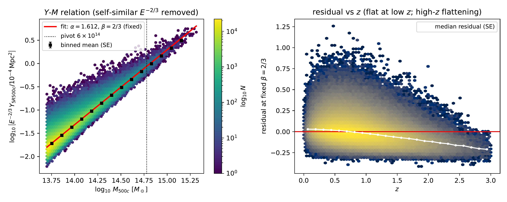
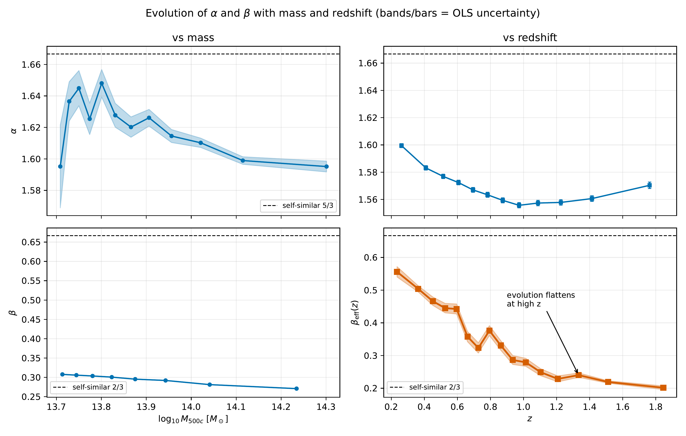
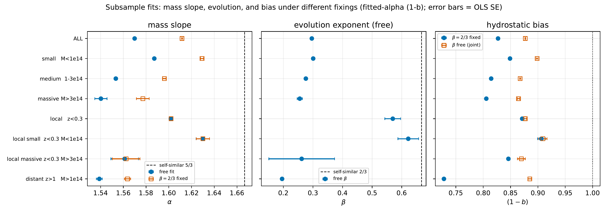
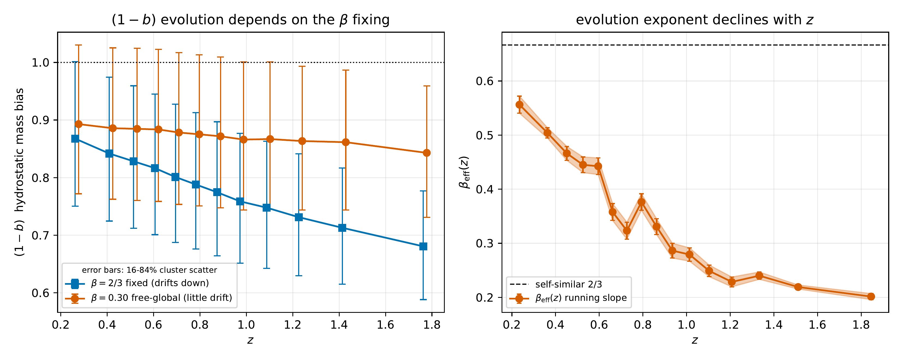

# Notebook 16 — The Y–M(–z) Scaling Relation from the FLAMINGO Catalogue

**Source:** `notebooks/16_yM_scaling_fit.ipynb`
**Inputs:** the `y0q` cluster catalogue from the FLAMINGO **L2p8_m9** run (columns `z`, `M_500c`,
`Y_5R500c_Mpc2`), with an Arnaud B=1 calibration.
**Figures (4):** `nb16_yM_scaling`, `nb16_param_evolution`, `nb16_subsample_fits`,
`nb16_evolution_fixings` (each `.pdf` + `.png`; PNGs are 300 dpi, rasterised from the vector PDFs).

---

## 1. What this notebook does

It measures the Planck-style integrated-Compton-Y vs mass scaling relation, `Y–M(–z)`, **directly
from the cluster catalogue** with no halo model or theory profile in the loop. The model is

```
E^{-beta} * [ D_A^2 Y_500 / (1e-4 Mpc^2) ]  =  Y* (h/0.7)^{-2+alpha} * [ (1-b) M_500 / 6e14 ]^alpha
```

so in log space (pivot `M = 6e14 M_sun`):

```
log10( Y_5R500c / 1e-4 ) = c0 + alpha * log10( M_500c / 6e14 ) + beta * log10( E(z) )
c0 = log10(Y*) + (alpha - 2) * log10(h/0.7),   h = 0.681 (FLAMINGO D3A).
```

### Key measurement identity

The catalogue column `Y_5R500c_Mpc2` already stores the **spherical** Compton-Y inside `5 R_500c` as
`D_A^2 Y` (physical area, Mpc^2). So the LHS is just `Y_5R500c_Mpc2 / 1e-4` and **no per-cluster
angular-diameter distance is needed**. The only cosmology input is `E(z) = H(z)/H_0`, computed once
with `hmfast` on a 600-point z-grid and interpolated (`JAX_PLATFORMS=cpu`).

### The degeneracy that drives every framing

In-sample, the amplitude `Y*` and the hydrostatic bias `(1-b)` are **perfectly degenerate** — they
only ever enter as the product `Y* (1-b)^alpha`. One of them **must** be pinned to obtain the other.
The notebook works through several framings, each fixing different things; **all are listed below.**

---

## 2. All the methods (what is fixed, what varies)

| # | Method | Fixed | Varied / fitted | Inferred output |
|---|---|---|---|---|
| **1** | `alpha` + scatter fit | `beta = 2/3` (self-similar), `Y*` | `alpha`, intrinsic scatter | `alpha`, scatter, FLAMINGO pivot `c0` |
| **2** | Subsample investigation | per-row: `beta=2/3` **or** free | `alpha`, `beta` (free version), `(1-b)` | where the relation holds; subsample `alpha`/`beta`/`(1-b)` |
| **3** | `(1-b)` inference | `beta = 2/3`, `Y* = Planck`, `alpha_P = 1.79` | (nothing fitted — uses Sec 1 `c0`) | `(1-b)` |
| **4** | Joint free fit | **only** `Y* = Planck` | `alpha`, `beta` (**free**), `(1-b)` | all three at once from one OLS |
| **6** | Parameter evolution | varies per panel (see below) | `alpha(M)`, `alpha(z)`, `beta(M)`, `beta(z)`, `(1-b)(M,z)` | running/binned trends with M and z |

(Sec 5 is the scaling-relation figure; Sec 7 is the summary.)

### Method 1 — fit `alpha` and scatter, `beta = 2/3` fixed
Remove self-similar evolution: `w = log10(Y/1e-4) - (2/3) log10 E` is then a pure power law in mass,
`w = c0 + alpha log10(M/6e14)`. Fit per-cluster **and** binned in mass. Here `Y*_FL` is FLAMINGO's
own amplitude for `Y_5R500c` at `(1-b)=1` — **not** the Planck `Y*` (used only in Method 3).
**Fixed:** `beta=2/3`, `Y*` (FLAMINGO). **Varied:** `alpha`, scatter.

### Method 2 — subsamples: massive / small / local / distant
Refit in subsamples to test where the relation holds. For each, report **free** `(alpha, beta)`
*and* `alpha`, `(1-b)` at fixed `beta=2/3`. This is where the `beta` story is established (see §3).
**Fixed:** depends on the column — either `beta=2/3` or fully free. **Varied:** `alpha`, `beta`, `(1-b)`.

### Method 3 — fix `Y* = Planck`, infer `(1-b)` (the adopted ground-truth method)
Planck measures `Y_500` (within `R_500`); the catalogue stores `Y_5R500c` (within `5 R_500`). Convert
with the A10 UPP **spherical aperture ratio** `rho = Y(<5R500)/Y(<R500) = 1.814`. The mass bias is the
amplitude shift placing FLAMINGO's relation onto Planck's, converted to a mass shift with the
**relation's own fitted slope** `alpha` (NOT Planck's `alpha_P`, since we fit `alpha`):
`(1-b) = 10^{ [ c0 - log10(rho) - logY*_P - (alpha-2) log10(h/0.7) ] / alpha }`.
**Fixed:** `Y*=Planck`, aperture `rho`. **Inferred:** `(1-b)` (using the fitted `alpha`). All figures
use this. *(Adopting Planck's `alpha_P = 1.79` in the conversion instead is a valid Planck-anchored
alternative that gives `0.845`; we do not use it.)*

### Method 4 — fix only `Y*`, jointly infer `alpha`, `beta`, `(1-b)`
Pinning `Y*` to Planck breaks the `Y*`–`(1-b)` degeneracy, so a **single** OLS on
`[1, log10 M, log10 E]` identifies all three at once: `alpha` (mass slope), `beta` (E slope, **now
free**), and `(1-b)` from the intercept using the fitted `alpha`. This is the original free fit,
relabelled so the intercept becomes `(1-b)` relative to Planck instead of a free FLAMINGO `Y*`.
**Fixed:** only `Y*=Planck`. **Varied:** `alpha`, `beta`, `(1-b)`.

### Method 6 — evolution of the slopes with M and z (the `nb16_param_evolution` figure)
Four separate slope measurements, each holding different things fixed so the parameter of interest
is the only one free where it has lever arm. The four panels:

| Panel | Quantity | Held fixed | What varies / how measured |
|---|---|---|---|
| (0,0) | `alpha` vs **M** | `beta = 2/3` (removed in `w`) | running slope `d<w>/d<log10 M>` |
| (0,1) | `alpha` vs **z** | `beta = 2/3` | per z-bin OLS of `w` on `[1, log10 M]`; read `alpha` |
| (1,0) | `beta` vs **M** | nothing fixed within bin | per mass-bin OLS of `y` on `[1, log10 M, log10 E]`; read `beta` |
| (1,1) | `beta` vs **z** | `alpha = 1.612` (global, to mass-correct) | running slope `d<Q>/d<log10 E>`, `Q = log10(Y/1e-4) - alpha log10 M` |

Uncertainties are OLS standard errors (error bars on per-bin points, propagated SE bands on running
curves). The mass bias `(1-b)` is **not** an evolution panel: it is a single relation-level number
(the amplitude shift), so its only meaningful "evolution" is the spurious z-drift induced by fixing
`beta = 2/3`, shown separately in `nb16_evolution_fixings` (Method 6b).

**Why there are "several evolution things":** the `(1-b)`(z) you infer depends entirely on whether
`beta` is fixed or free. With **`beta = 2/3` fixed** it **drifts down with z** (`~0.87 -> 0.68`), an
**artefact** of forcing self-similar evolution onto a sample that evolves more weakly; with **`beta`
free** it is **nearly flat at `~0.87`** (Method 4). That contrast is the point of `nb16_evolution_fixings`.

---

## 3. Why `beta = 2/3` is fixed (the central physics finding)

A single power law `E(z)^beta` over the **full** `0 < z < 3` returns `beta ~ 0.30`, looking strongly
sub-self-similar. This is a **high-z artefact**, not real physics:

- The evolution is not a pure power law in `E`; the long high-z lever arm (`z > 1` gives `beta ~ 0.2`)
  drags the global fit down.
- **Local clusters (`z < 0.3`) recover `beta = 0.57`**; local low-mass (`M < 1e14`) give `beta = 0.62`
  — right at self-similar `2/3`.

So self-similar evolution holds **locally**, and the low global `beta` is a lever-arm effect. That is
why the headline fits fix `beta = 2/3` and treat the apparent decline as the object of study.

---

## 4. Results

### Method 1 (`beta = 2/3` fixed)
- slope **`alpha = 1.612`** (binned cross-check `1.611`)
- intrinsic scatter **`0.122 dex`**
- FLAMINGO amplitude `Y*_FL[(1-b)=1] = 0.863`

### Method 2 — subsamples (`alpha_free / beta_free / (1-b)`)
| Subsample | alpha (free) | beta (free) | (1-b) |
|---|---|---|---|
| All clusters | 1.570 | 0.296 | 0.877 |
| Small `M < 1e14` | 1.587 | 0.301 | 0.864 |
| Massive `M > 3e14` | 1.540 | 0.256 | 0.829 |
| Local `z < 0.3` | 1.602 | **0.570** | 0.887 |
| Local + massive (`z<0.3`, `M>3e14`) | 1.561 | 0.262 | 0.867 |
| Distant `z > 1` | 1.539 | **0.196** | 0.761 |

`(1-b)` is stable at `~0.83–0.89` across mass; the distant population is mildly lower. Local clusters
recover near-self-similar `beta`; the distant population drives the low global value.

### Method 3/4 — hydrostatic bias (fitted-alpha, ground truth)
With `rho = 1.814` and Planck 2015 XXIV anchors, converting with the relation's **own fitted `alpha`**:
- **`(1-b) ~ 0.87` (`b ~ 0.13`) all clusters** (joint free-`beta` fit: `0.877`; `beta=2/3` fixed: `~0.83`)
- per-subsample `(1-b)` spans `~0.73-0.91` (see `nb16_subsample_fits`)

*(For reference only, not used: adopting Planck's slope `alpha_P = 1.79` in the conversion gives
`0.845` all clusters, `0.867` massive+local.)*

### Method 4 — joint free fit (only `Y*` pinned), all clusters
- `alpha = 1.570`, `beta = 0.296`, **`(1-b) = 0.877`** (`b = 0.123`), scatter `0.116 dex`
- `(1-b)` stable at `0.865–0.909` across subsamples; `beta` climbs toward `~0.6` locally.

### Method 6 — evolution (alpha and beta only)
- `alpha(z) ~ 1.56–1.60`; `alpha(M) ~ 1.6` (below self-similar `5/3`).
- `beta(M)`: mild `0.31 -> 0.27`.
- **`beta(z)` falls from `0.556` at `z ~ 0.25` to `0.202` at `z ~ 1.85`** — the headline; a single
  `E^beta` breaks down.
- `(1-b)` is a single relation-level number, not a function of M or z, so it is **not** a panel here;
  its dependence on the `beta` fixing is shown in `nb16_evolution_fixings` instead.

---

## 5. Figures

*All four figures carry uncertainties* (OLS standard errors, or 16-84% cluster scatter for `(1-b)`;
propagated SE bands on running curves). **`(1-b)` is computed one way everywhere (the ground-truth
method):** the relation's amplitude shift versus Planck, converted to a mass bias with the relation's
**own fitted `alpha`**. No per-cluster values, no Planck-slope (`alpha_P`) projection.

### `nb16_yM_scaling.{pdf,png}` — the scaling relation and its residuals


- **Left:** hexbin of `log10(Y_5R500c)` with the self-similar `E^{-2/3}` evolution divided out, so
  the points collapse onto the mass relation. Red line = the `alpha = 1.612`, `beta = 2/3` fit;
  dotted vertical line = the `6e14 M_sun` pivot. Colour = `log10 N`.
- **Right:** residual vs redshift — **flat at low z, declining at high z**, the visual signature of
  the high-z flattening that makes a single `E^beta` inappropriate over the full range.

### `nb16_param_evolution.{pdf,png}` — alpha and beta vs M and z


A 2x2 grid (rows `alpha` / `beta`, columns **vs mass** / **vs redshift**), produced by Method 6.
`beta(z)` (bottom-right, orange) is the headline, declining from `~0.56` to `~0.20`; `alpha` stays
`~1.56–1.64`, below the self-similar `5/3` dashed line. Bands/bars are OLS standard errors (error bars
on per-bin points, propagated SE bands on running curves). `(1-b)` is deliberately **not** a panel
here: it is one relation-level number, not a function of M or z (see `nb16_evolution_fixings`).

### `nb16_subsample_fits.{pdf,png}` — Methods 2 & 4 visualised


Three panels (`alpha`, `beta`, `(1-b)`) across the eight subsamples, with **OLS standard errors as
error bars**. Left: the free-fit mass slope `alpha` (filled) vs the slope obtained with `beta = 2/3`
fixed (open) — fixing the evolution shifts `alpha` upward by `~0.02–0.07`. Middle: the free evolution
exponent `beta`, which climbs to near self-similar `2/3` for **local** subsamples and collapses to
`~0.2` for the **distant** subsample (the small/narrow subsamples, e.g. local-massive, carry visibly
larger error bars). Right: `(1-b)` (fitted-alpha, ground truth) under `beta = 2/3` fixed (filled) vs `beta` free (open);
values run `~0.73-0.91`, agreeing across framings except for the distant population, where the
`beta = 2/3` assumption pushes `(1-b)` down to `~0.73`.

### `nb16_evolution_fixings.{pdf,png}` — the same quantity, different fixing


The direct illustration of "several evolution things depending on what is fixed":
- **Left:** `(1-b)` (fitted-alpha, ground truth) vs z, the **same estimator as `nb16_subsample_fits`**,
  so the figures agree (`~0.87` at low z). Error bars are the **16-84% cluster scatter** (the SE of the
  mean is `~0.003`, sub-pixel). With **`beta = 2/3` fixed** (blue) `(1-b)` **drifts down** from `~0.87`
  to `~0.68` (high-z amplitude over-subtracted: the artefact). De-evolving with the **global free
  `beta ~ 0.30`** (orange) leaves it **flat at `~0.84-0.89`** (all-z mean `0.873`). Same data, opposite
  conclusion about z-evolution of the bias.
- **Right:** the running-slope `beta_eff(z)` (SE band + error bars) declines from `~0.56` near
  `z = 0.25` (close to self-similar `2/3`) to `~0.20` by `z ~ 1.8`, which is *why* imposing a single
  `beta = 2/3` distorts the inferred bias.

> **One `(1-b)` method everywhere (ground truth).** All figures convert FLAMINGO's fitted amplitude to
> `(1-b)` using the relation's **own fitted `alpha`** (`~1.6`), so they agree (`~0.85-0.87`). We do not
> use the Planck-slope (`alpha_P = 1.79`) conversion anywhere in the figures.

---

## 6. Takeaways

1. FLAMINGO `Y–M` slope **`alpha ~ 1.61`**, shallower than self-similar `5/3` and Planck `1.79`,
   with `~0.12 dex` intrinsic scatter.
2. Self-similar evolution (`beta = 2/3`) **holds locally** (`z < 0.3`); the global `beta ~ 0.3` is a
   high-z lever-arm artefact, and `beta(z)` genuinely declines with redshift.
3. Inferred hydrostatic bias **`(1-b) ~ 0.85–0.88`** (`b ~ 0.12–0.15`), consistent with the Planck
   cluster-count bias once `Y_5R500c` is mapped to `Y_500` via the A10 aperture ratio.
